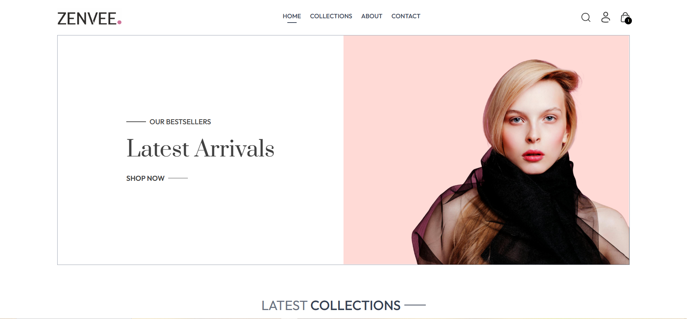
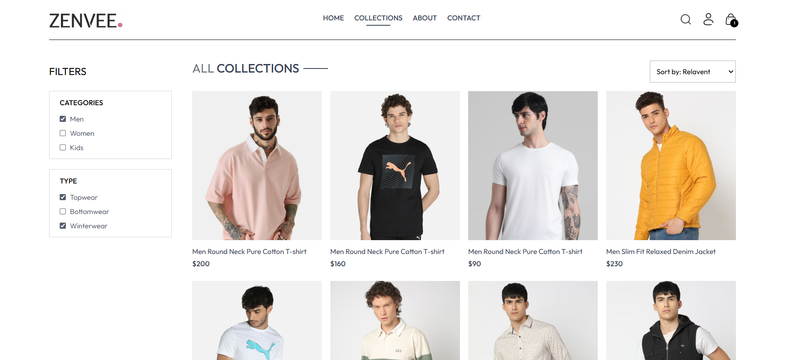
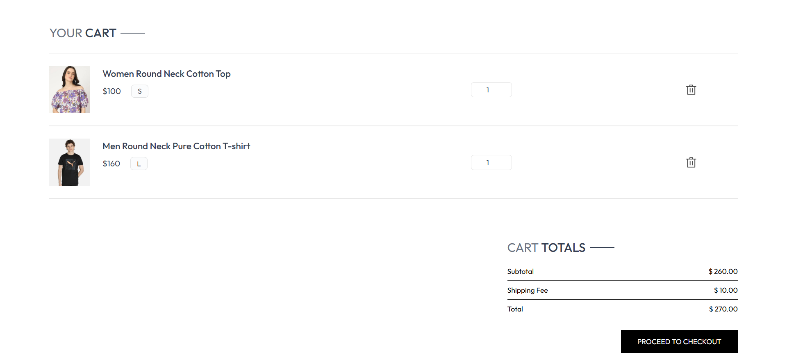
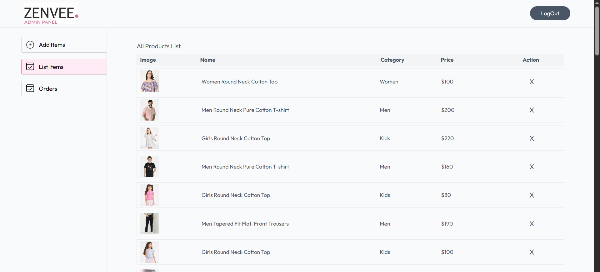
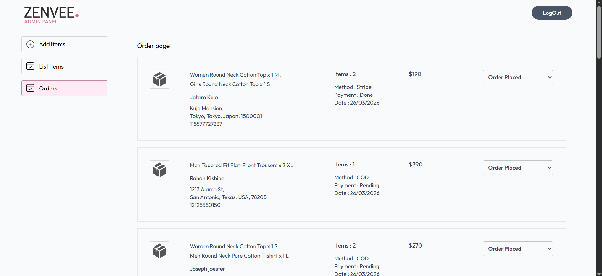

# 🛒 Zenvee - Full Stack E-Commerce Web Application

A production-ready full-stack e-commerce web application built using the MERN stack. It features secure authentication, admin dashboard, product management, Stripe payment integration, order tracking, and a fully responsive modern UI.

---

## 🌐 Live Demo

👉 https://zenvee-lyart.vercel.app/

---

## 🚀 Features

### 👤 User Features

* 🔐 JWT-based Authentication (Login / Signup)
* 🛍️ Browse Products with Search & Filters
* 🛒 Add to Cart & Cart Management
* 💳 Secure Checkout with Stripe Payment Gateway
* 📦 Order Tracking System with real-time status updates
* 🔔 Interactive UI with toast notifications for user actions
* 📱 Fully Responsive (Mobile + Tablet + Desktop)

### 🛠️ Admin Features

* 📊 Admin Dashboard for product & order management
* ➕ Add / Edit / Delete Products
* 📦 Manage and update order status (Processing → Out for Delivery → Delivered)

### ⚙️ System Features

* 🔄 Real-time UI updates with React
* 🔒 Secure REST APIs with validation
* ⚡ Optimized client-server communication
* 📦 Implemented order lifecycle tracking system (admin-controlled)
* 🔔 User-friendly notifications for success, errors, and actions

---

## 🛠️ Tech Stack

### Frontend

* React.js
* JavaScript (ES6+)
* Tailwind CSS

### Backend

* Node.js
* Express.js
* REST APIs

### Database

* MongoDB
* Mongoose

### Payment Integration

* Stripe API

### Tools & Deployment

* Git & GitHub
* Postman
* Vercel (Frontend & backend)

---

## 📸 Screenshots

---

## ⚙️ Run Locally

### Clone the project

git clone https://github.com/Mukesh-KB1/ecommerce-app
cd ecommerce-app

### Install dependencies

# frontend

cd client
npm install

# backend

cd ../server
npm install

### Setup environment variables

Create a `.env` file in server folder:

MONGO_URI=your_mongodb_connection
JWT_SECRET=your_secret_key
STRIPE_SECRET_KEY=your_stripe_secret

### Run the app

# backend

npm run server

# frontend

npm run dev

---

## 📌 Future Improvements

* ⭐ Product Reviews & Ratings
* 🔔 Push Notifications (real-time)
* 📦 Third-party shipment integration
* 🧠 AI-based product recommendations

---

## 👨‍💻 Author

Mukesh
https://github.com/Mukesh-KB1

---

## ⭐ If you like this project

Give it a ⭐ on GitHub — it helps a lot!
